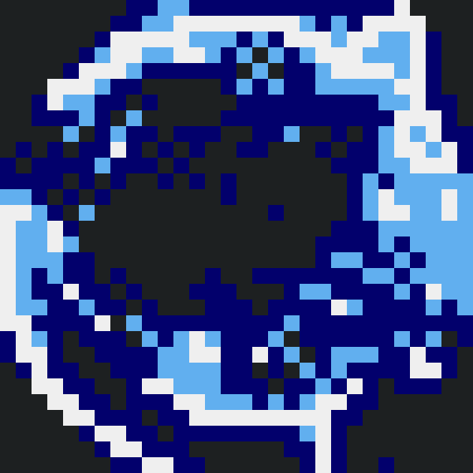

# Entropy



A (kinda) [celluar automata](https://en.wikipedia.org/wiki/Cellular_automaton) that I made for an art class!

## Building

### Linux

First, ensure that you have the correct bindings installed. For this you'll need `gcc`, `libsdl2-dev`, `pkg-config`, and `make`.

Next, clone the repo if you haven't already and run

```sh
$ make run
```

to run the application, or alternatively

```sh
$ make main
```

From there, the application can be run by using the executable produced in `./bin/main`.

### Windows

To be frank, I'm honestly not sure whether or not this builds on Windows. If you are going to try, first start by installing the needed dependencies as shown in the Linux section.

## Controls

The controls for this application are actually quite simple.

* Click, hold, and drag the left mouse button to draw in the selected color
* Click the right mouse button to cycle through the color options. This shows a dialog at the top left of the screen with the selected color. This dialog will go away once you start drawing
* Pressing `Space` on your keyboard "pauses" the CA, which just means that it does not call the update function (You can still draw in this state, though)
* Pressing `d` on your keyboard will toggle display of the draw color dialog previously mentioned. This is useful in case you forget what color you are drawing in

## Tinkering

The algorithm that I used to generate the image shown in this repo is actually quite basic, and it only took me a few draw strokes to make. Additionally, this celluar automata is actually quite static and not very life-like (which is the reason I called it a "kinda" celluar automata in the description). Because of this, there is probably a lot of room to tinker an create new things, which is really cool! So, even if you don't know too much about C++, you can still create your own cool CA. All you really need to edit is the `State::update` function in `src/state.cpp` and also the `colors` vector in the `main` function in `src/main.cpp`. I'm excited to see what you guys can make!